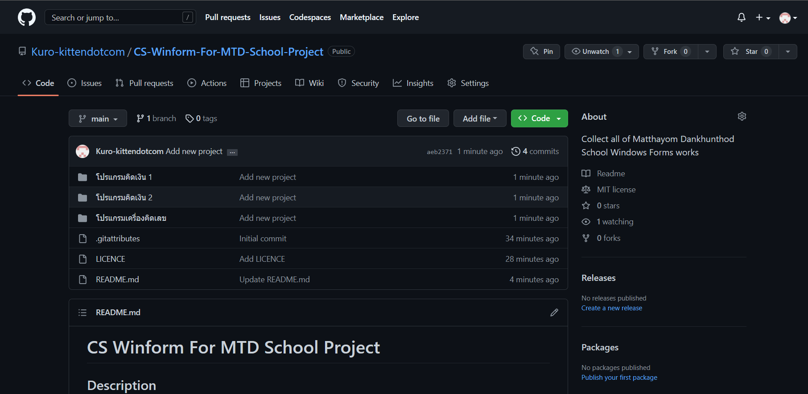
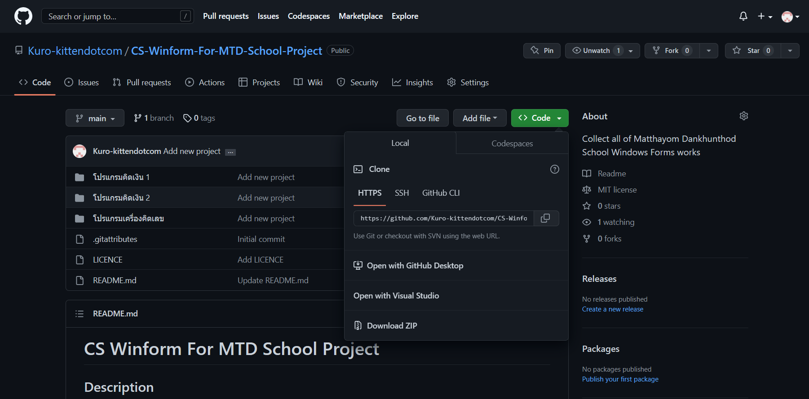

# C-Sharp Winform For MTD School Project

## Description


[EN] I have collect computer programming subject assignments from Matthayom Dankhunthod School. Everyone can use it for free!

[TH] เราได้รวบรวมงานวิชาการเขียนโปรแกรมคอมพิวเตอร์ของโรงเรียนมัธยมด่านขุนทด ระดับชั้นมัธยมศึกษาปีที่ 6 ประจำปีการศึกษา 2565 ไว้ที่นี่ โดยทุกคนสามารถใช้ได้ฟรี

- โค้ดอ่านง่าย กระชับ และมีคำอธิบาย
- ใช้อ้างอิงในการเรียน หรือนำไปต่อยอดเพื่อจัดทำเป็นโครงงานก็ได้
- มีเอกสารไว้สำหรับอธิบายเนื้อหา รวมไปถึงรูปแบบการทำงานของโปรแกรมให้
- ใช้ได้ฟรีทุกเนื้ัอหา

---

## วิธีการดาวน์โหลด

- เมื่อทุกท่านอยู่ในหน้าแบบนี้แล้ว ท่านจะสังเกตเห็นปุ่มที่ชื่อว่า ```Code``` ให้ท่านคลิกเข้าไป 1 ครั้ง



- ต่อมาท่านจะเห็นเมนูที่มีหลากหลายตัวเลือก ซึ่งสำหรับท่านที่ไม่เคยใช้ ```GitHub``` มาก่อนผมขอแนะนำให้ท่านกดตรง ```Download ZIP``` ในหน้าเมนู หรือกดคลิกดาวน์โหลดผ่านปุ่ม 
<a class="button" href="https://github.com/Kuro-kittendotcom/CS-Winform-For-MTD-School-Project/archive/HEAD.zip" aria-label="Download"></a>



- เมื่อท่านกดไปแล้วมันก็จะทำการดาวน์ไฟล์ให้ ซึ่งไฟล์ที่่ดาวน์โหลดส่วนใหญ่จะอยู่ที่โฟลเดอร์ ```Downloads``` ในคอมพิวเตอร์ของท่าน จากนั้นให้ค้นหาไฟล์ที่ดาวน์โหลดไว้ และทำการแตกไฟล์ เพื่อนำงานต่าง ๆ ไปใช้ตามที่ท่านต้องการ

---


## เอกสารอ้างอิง

<a class="button" href="https://docs.google.com/document/d/1boVGrmKsuQ8GAoloAz6_CN0i-6rlCV_YaBS4v2QZC94/edit?usp=sharing" aria-label="doc"></a>
